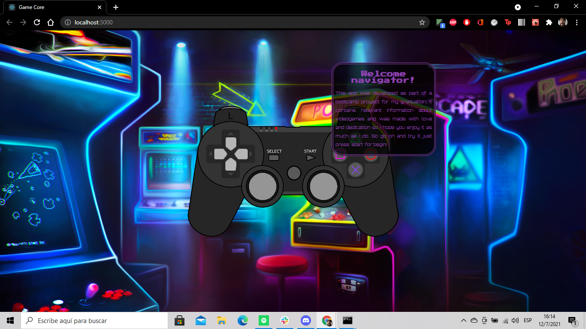
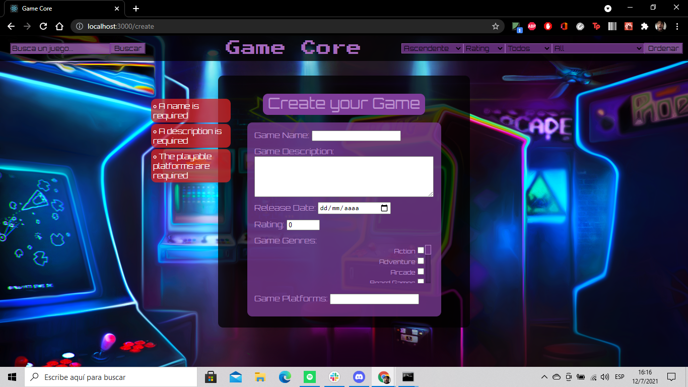
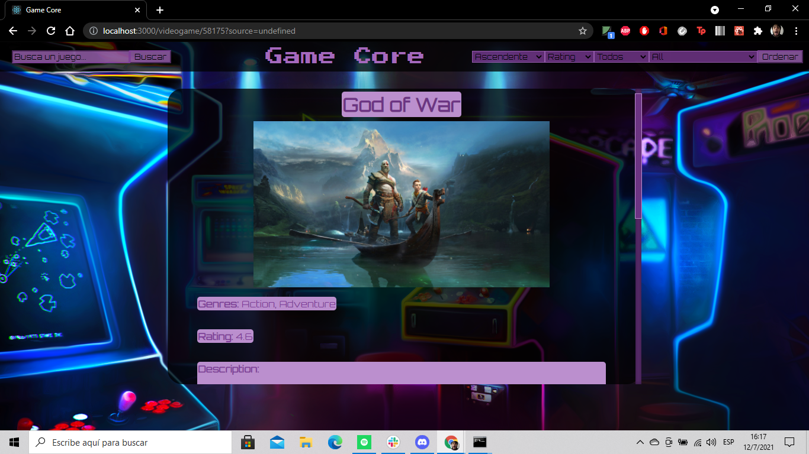
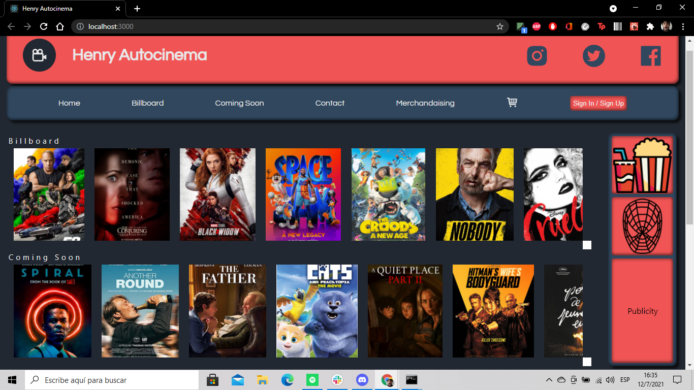
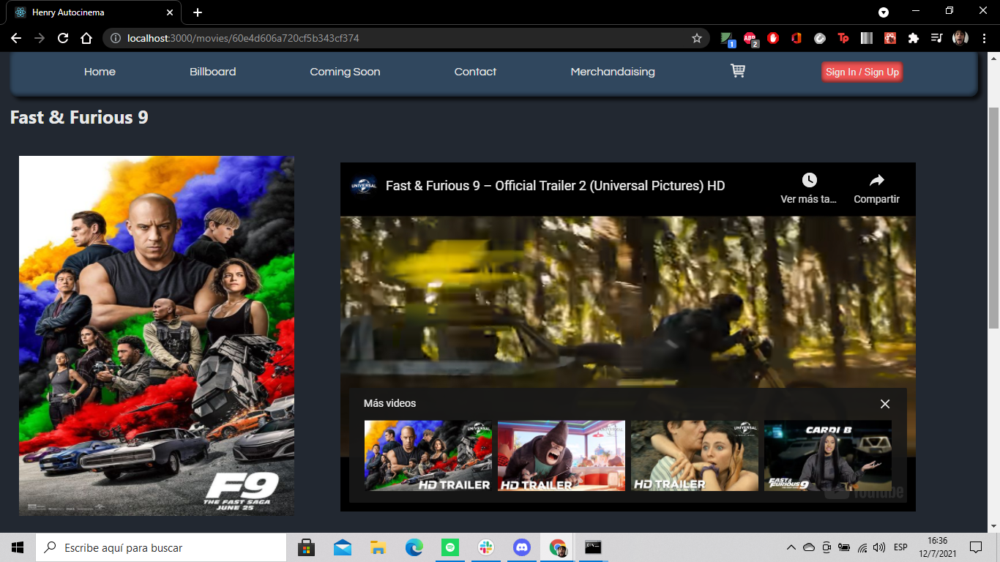
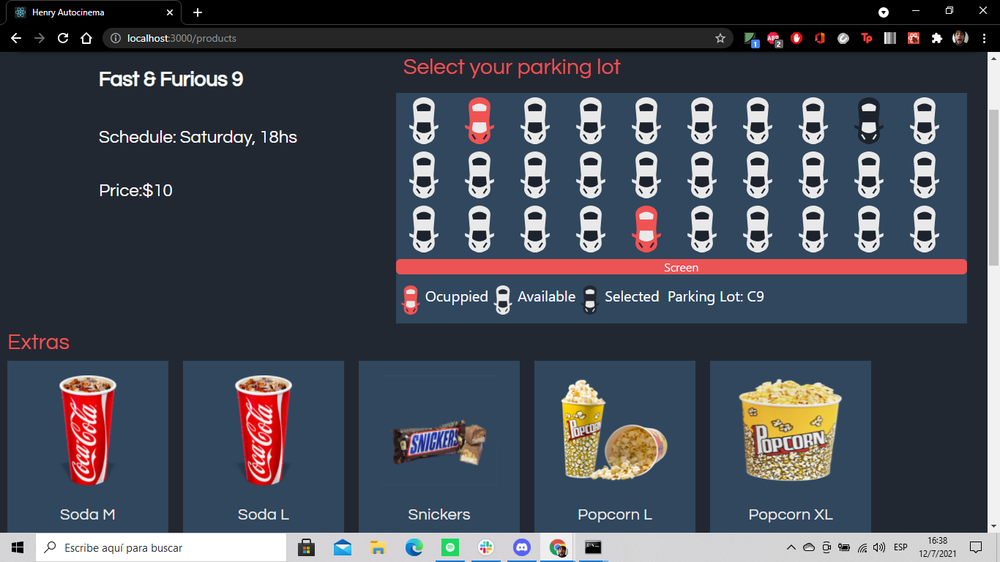

### Hi there, I'm Juan 👋
I'm a 24 years old argentinian student who stepped into full-stack web development in March of 2021. I'm passionate about both front and back-end development enjoying the satisfaction of building something new out of nowhere using my own acquired skills and learning some news in the process of developing each new proyect.
With me you are going to find a self-driven developer whose curiosity leads him to constantly improve his own tech skils looking forward to grasp a full understandment and control on what he is coding and building.
Below you are going to find more information about me, such as the proyects I have taken part of, the proyects I'm currently taking part of, my contact information and the complete stack I manage up to date.

*************

<h3> 🛠 &nbsp;Tech Stack</h3>

- 🌐 &nbsp;
  
  
  
  
  
  
  
  
  
  
  
- 🛢 &nbsp;
  
  
  
  
- ⚙️ &nbsp;
  
  
- 🔧 &nbsp;
  
  
*************
  
  

*************

<h3> 📫 &nbsp;Contact Me</h3>

*************

<h3> 💻 &nbsp;Proyects</h3>

<h4 align="center">Game Core</h4>

<h4 align="center">Autocinema</h4>

*************
